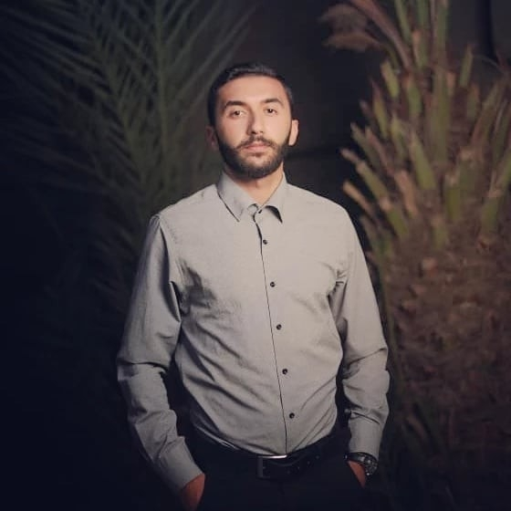

# Personal information
- Louai Baghdadi

# Personality Traits

- Strong analytical and problem-solving skills.
- Excellent communication skills, written and verbal.
- Highly trustworthy, discreet, ethical and friendly.
- Ability to adapt to diverse environment and to multi task.
- Good organizational skills
- Team work enthusiast.

# Education

# technical institute of tripoli, lebanon

- 2019 - 2020 technical bachelor (LT) in management information
- 2017 - 2019 Superior technical (TS2) management information
- 2014 - 2017 technical baccalaureate (BT3) Information technology

# Personal skills

# Native Language : Arabic

# Other Language(S) READING SPEAKING WRITING

- English Good Acceptable Acceptable
- French Good Fair Fair

# Computer skills:

- good command of Microsoft Office tools (Word, Excel, PowerPoint, Access)
- Programming languages (HTML5, CSS, JAVASCRIPT, ALGORYTME, MYSQL , React , express.js)

# Interests & Activities:

- Football, MMA (Mixed Martial Arts), Photography, social media, Learning new
languages.
- Volunteer Work at IMAN Scout.